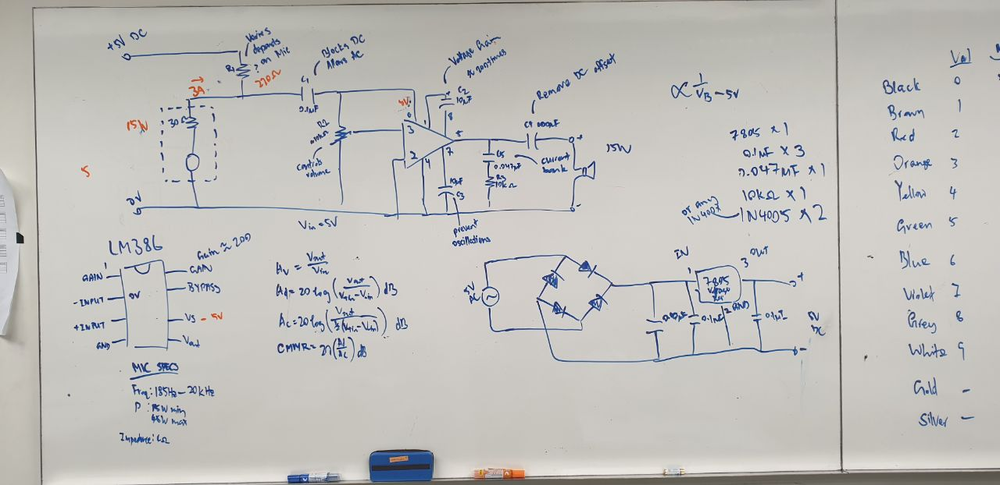

# Mic_to_Speaker_UROP

## Description
A circuit that allows for transition between microphone and speaker states.
  
Physically, the microphone is the speaker, and vice versa. This allows for effective echocommunication between 2 locations, such that a person's location may be accurately found out.  
  
This is particularly for devices that cannot afford to have that small difference in distance between transmitter and receiver, such as in the example of space communication.  
  
  
## Basic Circuit Diagram

  ## Credits
By UROP team:  
Axel, Minxuan, Calvin, Joe, Erlene  
  
  With help from:  
  Prof Jer Ming

